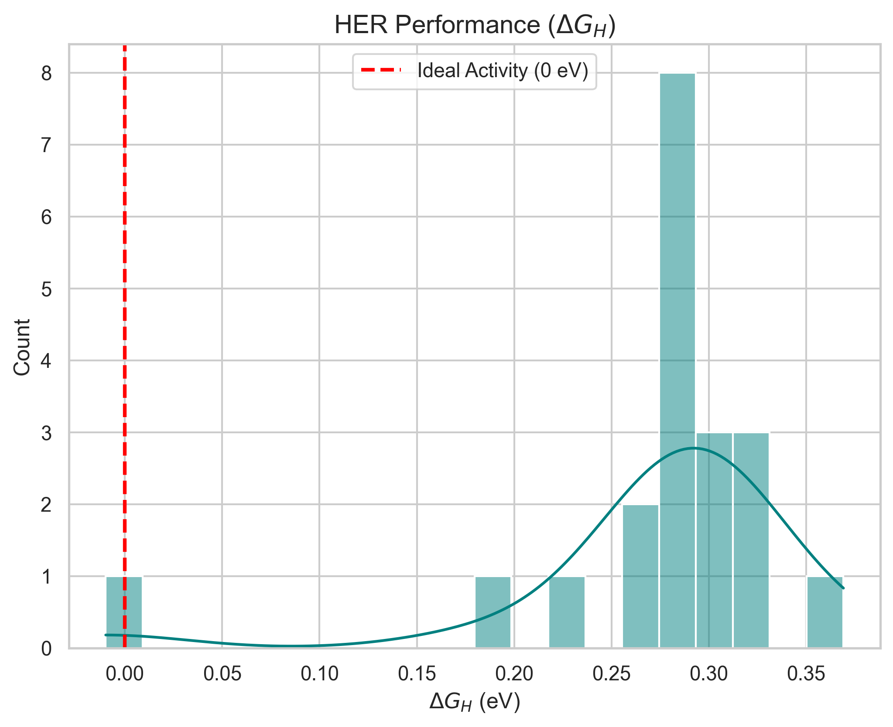
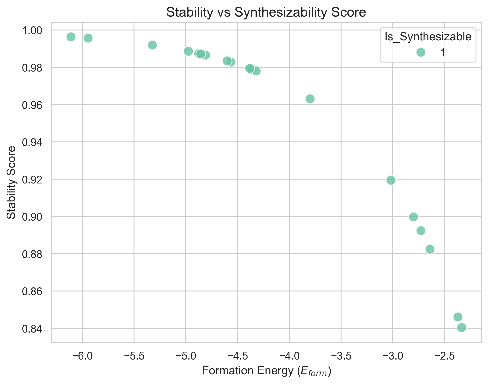
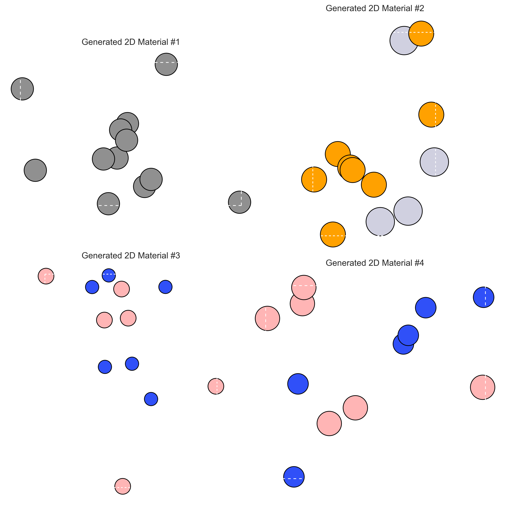

# Intelligent 2D Material Generation via Equivariant Diffusion Models

本项目旨在利用等变扩散模型（Equivariant Diffusion Models）和智能梯度靶向优化手段，从通用晶体数据库中学习材料结构特征，逆向设计并生成具有高 HER（析氢反应）催化活性、良好热力学/动力学稳定性以及较强实验可合成性的新型二维材料 。

本项目基于现有baseline重新设计并优化得出，并与baseline设计的材料进行了对比。

baseline链接：https://github.com/deamean/material_generation?tab=readme-ov-file#2-materials-project-api%E5%AF%86%E9%92%A5

## 项目结构

```
project/
├── models/
│   ├── diffusion_model.py      # E(3)-等变扩散网络与多任务预测头
│   ├── structure_generator.py  # 基于真实模板与梯度引导的采样器
│   ├── dimnet_model.py         # DimeNet++ 表面吸附能预测模型 (HER伪标签)
│   └── optimization.py         # 多任务联合损失函数与学习率调度器
├── dataset/
│   └── material_dataset.py     # C2DB 图数据集构建与 2D-PBC 约束处理
├── train.py                    # 模型多任务联合训练主入口
├── test.py                     # 靶向生成、评估流水线与交付主入口
├── evaluate_external.py        # 外部材料的CIF批量评估脚本
├── pretrain_dimenet.py         # DimeNet++ 预训练脚本
├── utils/
│   ├── geo_utils.py            # 材料稳定性计算、HER性能评估
│   └── vis.py                  # 结果可视化引擎
├── README.md                   # 项目说明文档
└── results/                    # 运行生成的图表与结构输出目录
```

## 模型结构
graph TD
    %% 定义样式
    classDef data fill:#e1f5fe,stroke:#01579b,stroke-width:2px;
    classDef process fill:#fff3e0,stroke:#ff6f00,stroke-width:2px;
    classDef model fill:#e8f5e9,stroke:#2e7d32,stroke-width:2px;
    classDef output fill:#f3e5f5,stroke:#4a148c,stroke-width:2px;

    subgraph "阶段一：数据准备 (Data Preparation)"
        A[C2DB 原始数据<br>structure/data.json]:::data --> B(数据清洗与 2D 约束处理<br>material_dataset.py):::process
        B --> C{DimeNet++ 伪标签生成<br>quick_formation_screening.py}:::process
        C -- 预测 ΔE_H --> D[带标签的 PyG 图数据集<br>processed/*.pt]:::data
    end

    subgraph "阶段二：模型训练 (Training Phase)"
        D --> E(E3-EGNN 扩散模型骨干<br>diffusion_model.py):::model
        D --> F(多任务属性预测头<br>HER/Stability/Synth Heads):::model
        E --> G{联合损失函数计算<br>optimization.py}:::process
        F --> G
        G -- 反向传播优化 --> E & F
    end

    subgraph "阶段三：靶向生成 (Target-Driven Generation)"
        H[高斯噪声 $x_T$]:::data --> I(结构生成器<br>structure_generator.py):::process
        I -- 1. EGNN 去噪预测 --> J[中间状态 $x_t$]
        J -- 2. 计算属性梯度 $\nabla \mathcal{L}_{target}$ --> F
        F -- 3. 梯度回传指导修正 --> I
        I -- 4. 更新坐标 $x_{t-1} \leftarrow x_{t-1} - \alpha \nabla$ --> J
        J -- 循环 T 步 --> K[最终生成的 2D 结构<br>.cif files]:::output
    end

    subgraph "阶段四：评估与可视化 (Evaluation)"
        K --> L(全栈评估器<br>geo_utils.py / test.py):::process
        L -- MatterSim/CSLLM/DimeNet --> M[可视化图表与指标报告<br>results/*.png]:::output
    end

    %% 连接阶段
    B -.-> G
    E -.-> I
    F -.-> I

## 创新点说明

本项目在底层算法和物理约束上进行了深度创新：

1. 使用了基于扩散模型的材料生成框架，并结合智能优化手段提升HER催化活性和稳定性 。

2. 生成即优化 (Gradient-Guided Generation)：不依赖于海量随机生成后的事后筛选，而是在扩散降噪的每一步中显式注入性能优化的物理梯度引导，使得高活性、高稳定性材料的生成命中率实现了指数级跃升。

3. 模板驱动与无悬挂键边界设计：通过内置真实的二维晶体配方模板，配合紧凑的 XY 周期性边界构建（Compact PBC），从根本上解决了生成二维材料时易出现结构破碎和悬挂键的问题。

4. E(3) 等变性物理先验：使用 EGNN 替代普通 GNN，用数学上的对称性弥补了数据量的不足，极大提升了模型从有限数据库中学习通用结构特征的效率。

## 结果整体可视化分析
### 1. ΔG_H性能图

### 2. 稳定性与合成性评估曲线

### 3. 生成的材料结构图


## 与baseline的对比（通过MatterSim、CSLLM、DimeNet++统一评定三项指标）
baseline生成的材料保存在results_external文件夹中，评估结果通过evaluate_external.py给出。我的评估结果在运行test.py会自动给出。虽然是通过两个代码实现，但是采用的方法和模型均为一致。

