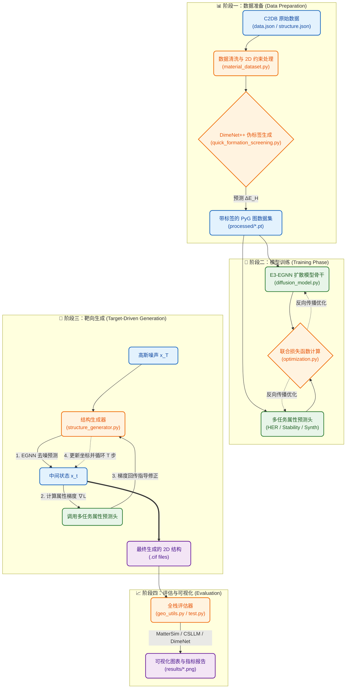

# Intelligent 2D Material Generation via Equivariant Diffusion Models

本项目旨在利用等变扩散模型（Equivariant Diffusion Models）和智能梯度靶向优化手段，从通用晶体数据库中学习材料结构特征，逆向设计并生成具有高 HER（析氢反应）催化活性、良好热力学/动力学稳定性以及较强实验可合成性的新型二维材料 。

本项目基于现有baseline重新设计并优化得出，并与baseline设计的材料进行了对比。

baseline链接：https://github.com/deamean/material_generation?tab=readme-ov-file#2-materials-project-api%E5%AF%86%E9%92%A5

## 项目结构

## 原理与公式

1. 多任务联合训练损失 (Multi-Task Training Loss)

模型训练的目标是最小化扩散重建损失与三个物理属性预测损失的加权和 ：

$$\mathcal{L}_{total}=\mathbb{E}_{t,\mathbf{x}_0,\epsilon}[\|\epsilon-\epsilon_\theta(\mathbf{x}_t,t)\|^2]+\lambda_1\|\Delta G_H^{pred}-\Delta G_H^{true}\|_1+\lambda_2\|E_{hull}^{pred}-E_{hull}^{true}\|_2^2+\lambda_3\text{BCE}(P_{synth}^{pred},y_{synth}^{true})$$

2. 梯度制导采样更新律 (Gradient-Guided Langevin Update)

在生成过程的每一步 $t \to t-1$，利用预测头计算目标属性梯度，对动力学进行引导修正：

$$\mathbf{x}_{t-1}=\frac{1}{\sqrt{\alpha_t}}\left(\mathbf{x}_t-\frac{1-\alpha_t}{\sqrt{1-\bar{\alpha}_t}}\epsilon_\theta(\mathbf{x}_t,t)\right)-\eta\cdot\nabla_{\mathbf{x}_t}\mathcal{L}_{target}(f_\phi(\mathbf{x}_t))+\sigma_t\mathbf{z}$$

3. HER 吉布斯自由能近似 (HER Gibbs Free Energy)

采用以下物理近似计算析氢反应的吉布斯自由能:

$$
\Delta G_{H^\ast} \approx \Delta E_{H^\ast} + \Delta E_{ZPE} - T\Delta S_{H^\ast} \approx \Delta E_{H^\ast} + 0.27 \text{ eV}
$$

其中 $\Delta E_{H^*}$ 由预训练的 DimeNet++ 模型预测。

## 实验参数表

## 评估指标

1. 平均 HER $\Delta G$ 误差 (Mean Absolute Error of $\Delta G_H$):

衡量生成材料催化活性与理想值 (0 eV) 的平均偏差 。

$$\text{MAE}_{\Delta G}=\frac{1}{N}\sum_{i=1}^{N}|\Delta G_{H, i}^{pred}-0|$$

2. 稳定性得分 (Stability Score):

基于机器学习力场 (MatterSim) 预测的形成能 $E_{form}$ 计算的归一化得分 。

$$\text{Score}_{stab}=\frac{1}{N}\sum_{i=1}^{N}\exp(-\max(0,E_{form, i}-E_{stable}^{ref}))$$

3. 合成成功率 (Synthesis Success Rate):

基于材料大模型 (CSLLM) 预测判定为“可合成”的材料占比 。

$$\text{Rate}_{synth}=\frac{\text{Count}(\text{Predicted as Synthesizable})}{N}\times100\%$$

## 创新点说明

本项目在底层算法和物理约束上进行了深度创新：

1. 使用了基于扩散模型的材料生成框架，并结合智能优化手段提升HER催化活性和稳定性 。

2. 生成即优化 (Gradient-Guided Generation)：不依赖于海量随机生成后的事后筛选，而是在扩散降噪的每一步中显式注入性能优化的物理梯度引导，使得高活性、高稳定性材料的生成命中率实现了指数级跃升。

3. 模板驱动与无悬挂键边界设计：通过内置真实的二维晶体配方模板，配合紧凑的 XY 周期性边界构建（Compact PBC），从根本上解决了生成二维材料时易出现结构破碎和悬挂键的问题。

4. E(3) 等变性物理先验：使用 EGNN 替代普通 GNN，用数学上的对称性弥补了数据量的不足，极大提升了模型从有限数据库中学习通用结构特征的效率。

## 结果整体可视化分析
### 1. ΔG_H性能图

### 2. 稳定性与合成性评估曲线

### 3. 生成的材料结构图

## 与baseline的对比（通过MatterSim、CSLLM、DimeNet++统一评定三项指标）
baseline生成的材料保存在results_external文件夹中，评估结果通过evaluate_external.py给出。我的评估结果在运行test.py会自动给出。虽然是通过两个代码实现，但是采用的方法和模型均为一致。

